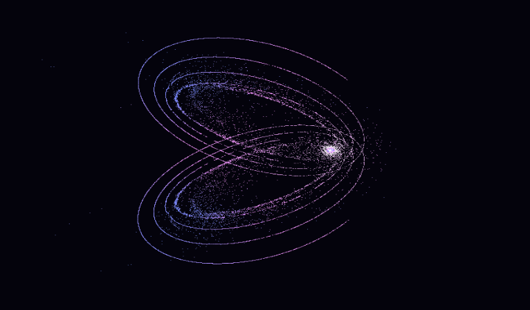

# ⚫ Black Hole Accretion Disk Simulation

A stunning GPU-accelerated black hole accretion disk simulation featuring thousands of particles orbiting a central singularity. Built with **Rust**, **WebAssembly**, and **WebGPU** for maximum performance directly in your browser.



## ✨ Features

- **🚀 GPU Acceleration**: All physics calculations run on your GPU using WebGPU compute shaders
- **🦀 Rust Performance**: Written in Rust and compiled to WebAssembly for near-native speed
- **🎮 Interactive 3D Controls**: Pan, zoom, rotate, pause, and reset with intuitive mouse and keyboard controls
- **🌈 Visual Effects**: Particles colored based on orbital velocity with smooth gradients and depth effects
- **☁️ Edge Deployment**: Ready for deployment on Cloudflare Pages for global distribution

## 🎯 Live Demo

**[galacto.tre.systems](https://galacto.tre.systems/)**

## 🎮 Controls

| Input                | Action                               |
| -------------------- | ------------------------------------ |
| **Left Mouse Drag**  | Rotate the camera around the center  |
| **Right Mouse Drag** | Pan the camera                       |
| **Mouse Wheel**      | Zoom in and out                      |
| **Spacebar**         | Pause/resume the simulation          |
| **R Key**            | Reset camera to default position     |

## 🚀 Quick Start

### Prerequisites

- **Rust**: Install from [rustup.rs](https://rustup.rs/)
- **Node.js**: Version 16+ for build scripts
- **WebGPU Browser**: Chrome 113+, Edge 113+, or Firefox with WebGPU enabled

### Installation

```bash
git clone https://github.com/rgilks/galacto.git
cd galacto
npm run setup
npm run dev
```

Open `http://localhost:8000` in a WebGPU-enabled browser.

## 🛠️ Development

| Command              | Description                              |
| -------------------- | ---------------------------------------- |
| `npm run setup`      | Install dependencies and add WASM target |
| `npm run build`      | Build WASM module and copy assets        |
| `npm run dev`        | Build and start development server       |
| `npm run serve`      | Start server (requires prior build)      |
| `npm run clean`      | Clean build artifacts                    |
| `npm run test`       | Run Rust tests                           |
| `npm run lint`       | Run Clippy linter                        |
| `npm run format`     | Format Rust code                         |
| `npm run deploy`     | Deploy to Cloudflare Pages               |

## 🏗️ Architecture

### Technology Stack

- **Core**: Rust with `wgpu` for WebGPU access
- **Frontend**: WebAssembly with minimal JavaScript glue
- **Graphics**: WGSL compute and render shaders with depth testing
- **Math**: `cgmath` for linear algebra
- **Build**: `wasm-pack` for WebAssembly compilation
- **Deploy**: Cloudflare Pages

### Project Structure

```
galacto/
├── src/                    # Rust source code
│   ├── lib.rs              # Main WASM entry point
│   ├── graphics.rs         # WebGPU initialization
│   ├── simulation.rs       # GPU simulation logic
│   ├── camera.rs           # 3D camera transforms
│   ├── input.rs            # Event handling
│   ├── utils.rs            # Helper functions
│   └── shaders/            # WGSL shaders
│       ├── update.wgsl     # Particle physics compute shader
│       └── render.wgsl     # Particle rendering shader
├── static/                 # Web assets
│   ├── index.html          # Main page
│   └── styles.css          # Styling
├── pkg/                    # Generated WASM output
├── Cargo.toml              # Rust dependencies
└── package.json            # Build scripts
```

## 🌐 Browser Support

| Browser         | Status   | Notes                                         |
| --------------- | -------- | --------------------------------------------- |
| **Chrome/Edge** | ✅ 113+  | WebGPU enabled by default                     |
| **Firefox**     | 🔧 110+  | Enable `dom.webgpu.enabled` in `about:config` |
| **Safari**      | ⚠️ 16.4+ | WebGPU support varies                         |

## 🔬 Physics Model

The simulation uses a simplified 3D N-body gravitational model:

- **Central Singularity**: Fixed gravitational source at origin
- **3D Particle Motion**: Euler integration with gravitational acceleration
- **Orbital Mechanics**: Circular orbital velocities with z-axis thickness
- **Boundary Conditions**: Elastic collisions with world boundaries

### Compute Shader (`update.wgsl`)

```wgsl
// Gravitational acceleration: a = -GM/r³ * position
let acceleration = -params.gm * inv_r3 * particle.position;

// Euler integration with velocity clamping
particle.velocity = particle.velocity * drag + acceleration * params.dt;
particle.position = particle.position + particle.velocity * params.dt;
```

### Render Shader (`render.wgsl`)

- 3D perspective transformation with depth testing
- Velocity-based coloring (blue → red)
- Depth-based alpha blending

## 🎨 Customization

### Simulation Parameters (`simulation.rs`)

```rust
const NUM_PARTICLES: u32 = 131072;  // Number of particles
let params = SimulationParams {
    dt: 0.016,          // Time step (60 FPS)
    gm: 40000.0,        // Gravitational strength
};
```

### Visual Style (`render.wgsl`)

```wgsl
// Color: blue (slow) -> red (fast)
let color = vec3<f32>(
    normalized_speed * 2.0,
    0.1,
    1.0 - normalized_speed
);
```

## 📊 Performance

- **Target**: 60 FPS with 131,072 particles
- **GPU Memory**: ~3MB for particle data
- **Compute**: Single dispatch per frame (~2,048 workgroups)

## 📄 License

MIT License - see [LICENSE](LICENSE)
